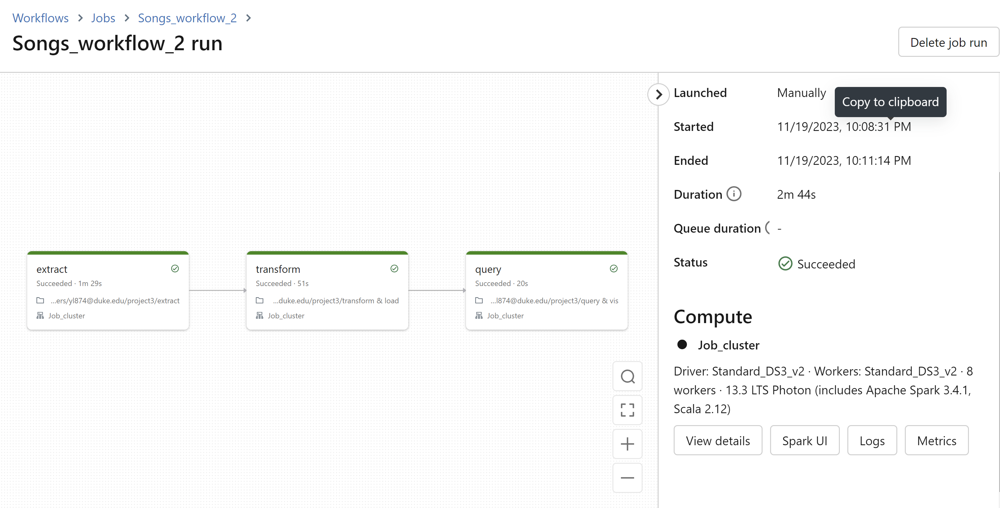
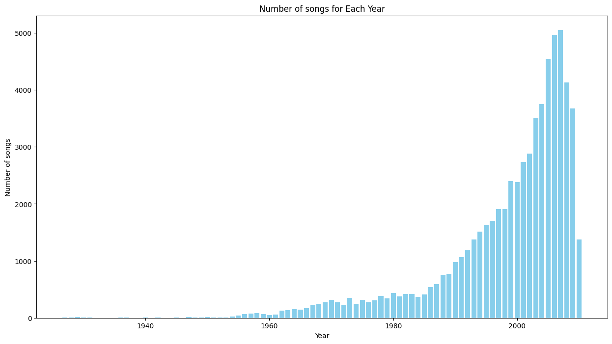
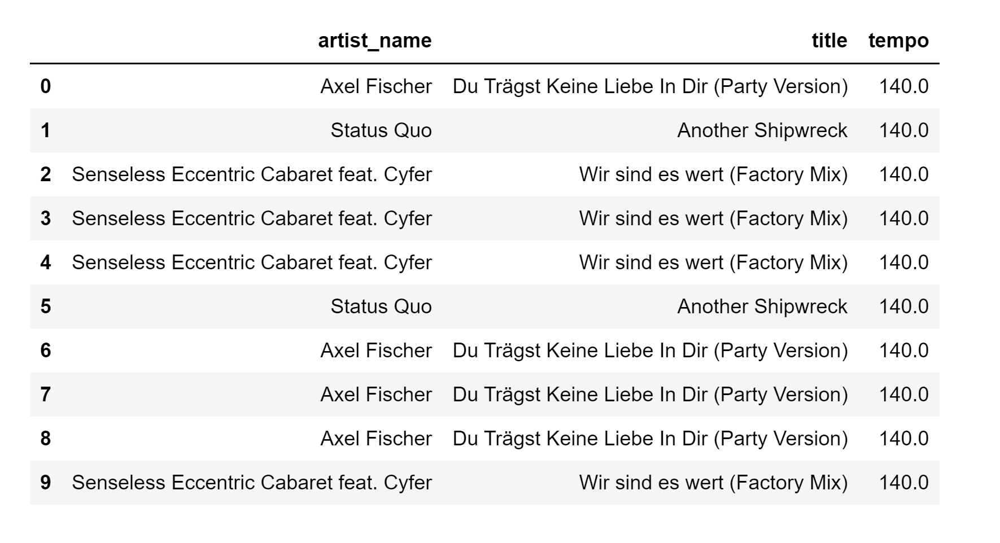

# 706_Project3_YL

This repository includes the main tasks for Project 3:

* `Makefile` is a configuration file used in Unix-based systems for automating tasks and building software. It contains instructions and dependencies for compiling code, running tests, and other development tasks.
* `.devcontainer` includes a Dockerfile and `devcontainer.json`. The `Dockerfile` within this folder specifies how the container should be built, and other settings in this directory may control development environment configurations.
* `Workflows` includes GitHub Actions, which contain configuration files for setting up automated build, test, and deployment pipelines for your project.
* `.gitignore` is used to specify which files or directories should be excluded from version control when using Git.
* `README.md` is the instruction file for the readers.
* `requirements.txt` is to specify the dependencies (libraries and packages) required to run the project.

## Project description
* Databricks notebook with ETL pipeline
* Delta Lake for data storage
* Spark SQL for data transformation
* Visualization of the transformed data
* Automated trigger to initiate the pipeline

## Project environment

* Use Azure Databricks for scripting
* Link GitHub to Azure Databricks
* Container built in `devcontainers` and virtual environment activated via `requirements.txt`

## Major steps
I use the million song database in Databricks DBFS.
* Extract data from URL: `extract.py` in `mylib` and `extract.ipynb` in Databricks
* Fetch data
* Transform and load data: `transform_load.ipynb` in Databricks
* Query transformation and data visualization
* File path checking for `make test`
* Clone repo into Databricks workspace
* Create new cluster and run

* Visualize one of the query results: number of songs during each year

* Query results

* Create new job to build a new ETL pipeline with automated trigger
* Add `JOB_ID`, `SERVER_HOSTNAME` and `TOKEN` in GitHub settings

## Video link

## References